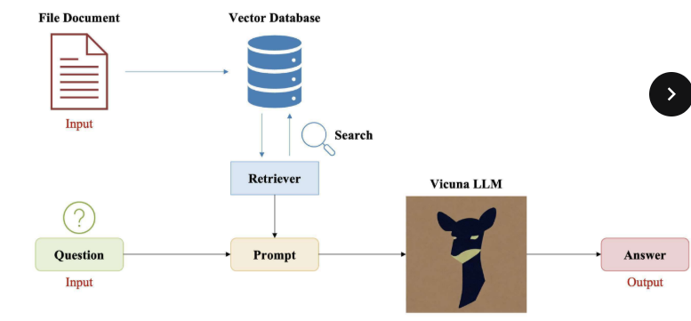
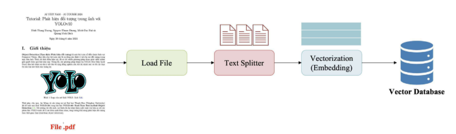
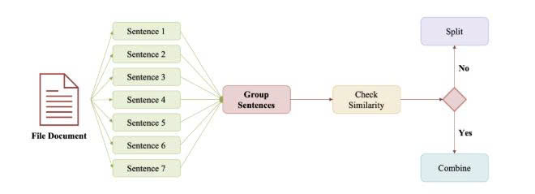

# PDF RAG Assistant (ChatBotVersion2)

Đây là một ứng dụng **RAG (Retrieval-Augmented Generation)** dùng **Streamlit** để chat với dữ liệu từ file PDF. Ứng dụng dùng:

- **LangChain + Chroma** (vector DB)
- **HuggingFace Transformers** (LLM + embedding)
- **LangChain Hub** để tải prompt RAG

## 🖼️ Minh hoạ (images)

1. `images/image.png`
2. `images/image-1.png`
3. `images/xy_ly_text.jpg`







---

## 🚀 Bắt đầu (Cài đặt môi trường)

### 1) Chuẩn bị Python

- Khuyến nghị dùng **Python 3.11 hoặc 3.12** (Torch hiện chưa hỗ trợ Python 3.13).
- Tạo và kích hoạt virtual environment (đảm bảo không cài thư viện toàn cục):

```powershell
# Nếu bạn có nhiều phiên bản Python, dùng py launcher để tạo venv với Python 3.11:
py -3.11 -m venv .venv

# Kích hoạt venv (PowerShell)
.\.venv\Scripts\Activate.ps1
```

> Nếu dùng cmd: `.
.venv\Scripts\activate.bat`

### 2) Cài đặt dependencies

```powershell
pip install --upgrade pip
pip install -r requirements.txt
```

> Nếu bạn gặp lỗi **không tìm thấy torch==2.2.2** (hoặc tương tự), đó là vì phiên bản Python đang dùng không tương thích với torch 2.2.x.
>
> - **Giải pháp 1 (khuyến nghị):** dùng Python 3.11/3.12.
> - **Giải pháp 2:** cài torch phiên bản phù hợp với Python 3.13+ (vd: `pip install torch==2.10.0`).
>
> Nếu bạn gặp lỗi **xung đột dependencies** (vd: transformers vs langchain-huggingface), đó là do phiên bản cũ không tương thích. Đã cập nhật `requirements.txt` với phiên bản mới hơn để giải quyết.

> Nếu bạn gặp lỗi do thiếu `streamlit`, cài thêm:
> `pip install streamlit`

---

## ▶️ Chạy ứng dụng

1) Chạy Streamlit app:

```powershell
streamlit run app.py
```

2) Trên trình duyệt, truy cập `http://localhost:8501` (nếu không tự mở).

3) Upload file PDF, nhấn **Xử lý PDF**, rồi đặt câu hỏi.

---

## 📂 Cấu trúc chính của project (giải thích mục đích từng file)

- `app.py` - **Giao diện Streamlit + điều phối luồng xử lý**: tải model, upload PDF, gọi pipeline RAG, hiển thị kết quả.
- `core/config.py` - **Cấu hình chung** (model name, max token, v.v.) để dễ thay đổi model/param.
- `core/llm_loader.py` - **Tải và tạo LLM pipeline** (TinyLlama, quantization 4-bit, HuggingFace pipeline).
- `core/embedding_loader.py` - **Tải embedding model** dùng để chuyển văn bản thành vector.
- `rag/pdf_processor.py` - **Xử lý PDF & tách văn bản**: đọc PDF, chia thành các chunk có ngữ nghĩa.
- `rag/rag_chain.py` - **Xây dựng RAG pipeline**: tạo vector database (Chroma), retriever, prompt, và gọi LLM để trả lời.
- `requirements.txt` - **Danh sách thư viện cần cài** để chạy ứng dụng.
- `test.py` - **Ví dụ demo khác**; dùng trực tiếp LangChain + Transformers để test ý tưởng (không dùng `core/`, `rag/`).

---

## 📝 Chạy thử nghiệm (tùy chọn)

- `test.py` là một phiên bản demo khác dùng trực tiếp LangChain + Transformers.

---

## 💡 Ghi chú

- Model mặc định tải từ HuggingFace (`TinyLlama/TinyLlama-1.1B-Chat-v1.0`) và có thể lớn, cần GPU hoặc cấu hình đủ mạnh.
- Nếu dùng CPU hoặc bị thiếu RAM, cân nhắc dùng model nhỏ hơn hoặc bật `device_map="auto"` và `load_in_4bit=True` (đã cấu hình sẵn trong `core/llm_loader.py`).

